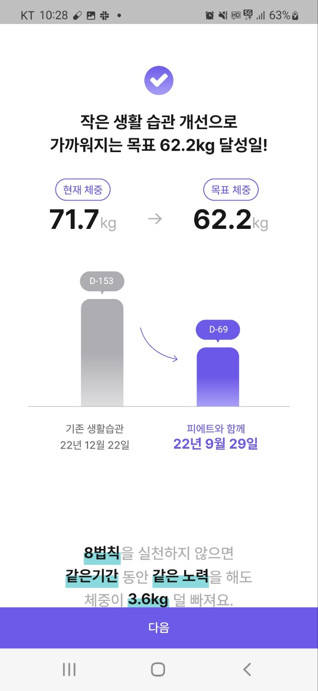
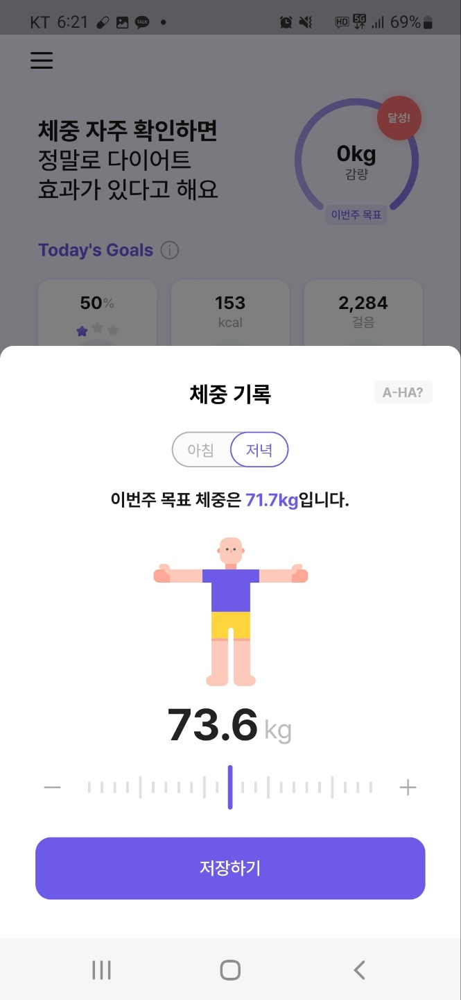
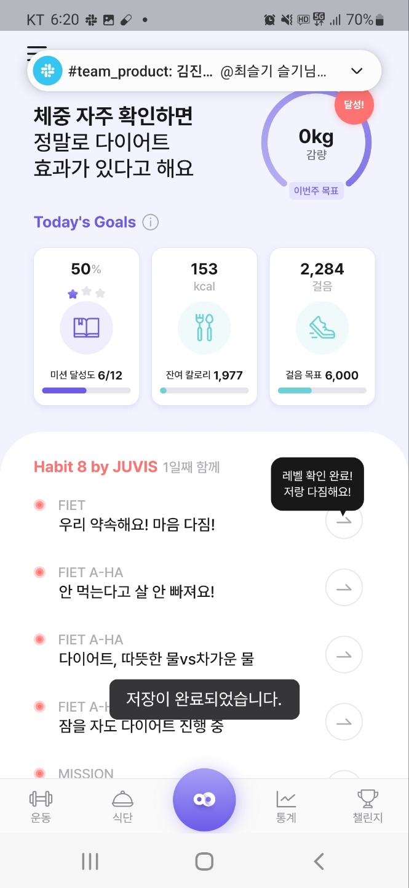
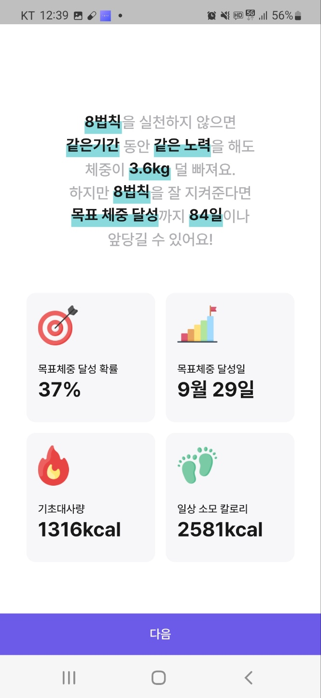

{:.list-inline}
- 회사명: FIET
- 진행일: 2022.03-2022.09

---

<h5>사용 기술</h5> 

Java17, Spring boot, Mybatis, PostgreSQL, Swagger UI

<h5> 주요 역할 </h5> 

1. 사용자 생활 습관 설문 데이터 베이스 설계 및 개발
 

2. 개인 맞춤형 솔루션 제공 온보딩 설문 로직 개발 및 신체 정보 머신 러닝 종합 데이터 통신 속도 개선

3. 기간 별 사용자 신체 데이터 통계 조회 서비스 개발 및 Query 개선을 통한 조회 속도 향상 

4. 실시간 사용자 신체 데이터를 통한 12주 목표 체중 감량 시스템 개발 

5. 실시간 사용자 행동 추적을 통한 사용자 챌린지 시스템 개발 

6. 시스템 기획 데이터 로직 변경을 위한 CSV 로직 변경 시스템 개발 

---
   